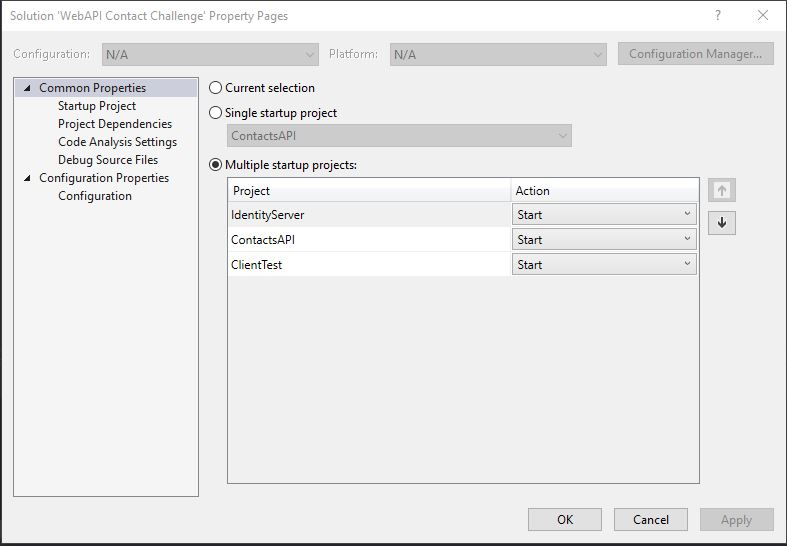

<h3 align="center">WebAPI-Contact-Challenge</h3>

<!-- TABLE OF CONTENTS -->
<details open="open">
  <summary>Table of Contents</summary>
  <ol>
    <li>
      <a href="#about-the-project">About The Project</a>
      <ul>
        <li><a href="#built-with">Built With</a></li>
      </ul>
    </li>
    <li>
      <a href="#getting-started">Getting Started</a>
      <ul>
        <li><a href="#prerequisites">Prerequisites</a></li>
        <li><a href="#installation">Installation</a></li>
      </ul>
    </li>
    <li><a href="#usage">Usage</a></li>
    <li><a href="#other-information">Other information</a></li>
    <li><a href="#improvement">Improvement to make</a></li>
    <li><a href="#contact">Contact</a></li>
  </ol>
</details>


<!-- ABOUT THE PROJECT -->
## About The Project
Contacts-API is a basic web API with two CRUD endpoint: contactsapi/contact and contactsapi/skill. The api support user authentication. 
The solution also contain an identity server and a small web application to easily test the api, both was quickly designed only for testing purpose 

### Built With
[ASP.NET Core 5.0](https://docs.microsoft.com/fr-fr/dotnet/core/dotnet-five)


<!-- GETTING STARTED -->
## Getting Started

### Prerequisites
1. [Visual Studio 2019](https://visualstudio.microsoft.com/fr/downloads/)
2. [.NET 5](https://dotnet.microsoft.com/download/dotnet/5.0)
3. [SQL Server LocalDB](https://docs.microsoft.com/en-us/sql/database-engine/configure-windows/sql-server-express-localdb?view=sql-server-ver15)


### Installation

1. Clone the repo
   ```sh
   git clone https://github.com/viollef/WebAPI-Contact-Challenge.git
   ```

<!-- USAGE EXAMPLES -->
## Usage
1. Open WebAPI Contact Challenge/WebAPI Contact Challenge.sln</br>
2. Launch "IndentityServer", "ContactsAPI" and "ClientTest" projects with the vs Multiple Startup Project available in the solution properties:
 </br>
3. Use the webapp "ClientTest" to test the API. You need to login with a test account: {user: alice, pwd: alice} or {user: bob, pwd: bob}</br>
4. For testing for testing purposes you can use [PostMan](https://www.postman.com/) or equivalent and send web requests to the CRUD EndPoints: 
*https://localhost:44386/contactsapi/contact
*https://localhost:44386/contactsapi/skill </br>
The JSON Web Token (JWT) required for auth is available on the "ClientTest" webapp project </br>

<!-- OTHER INFORMATION -->
## Other Information

1. Object-relational mapper: </br>
	-[EntityFramework6](https://docs.microsoft.com/fr-fr/ef/ef6/) </br>
	-LazyLoading is disable, the data are mostly managed with eager loading </br>

2. Database: </br>
	-The database is created with EntityFramework [migrations](https://docs.microsoft.com/fr-fr/ef/core/managing-schemas/migrations/?tabs=dotnet-core-cli). By default the DB is located in C:\Users\<user> </br>
	-The migration code is generated with the command: "add-migration" in the Package Manager Console </br>
	-Diagram: </br>
	 </br>
	
3. Authentification </br>
	-IdentityServer4 </br>
	-oauth2 </br>
	-JSON Web Token (JWT)


<!-- IMPROVEMENT -->
## Improvement to Make
1. Add unit tests
2. Improve API error handling
3. Avoid contact or skill duplicates (check by email for example)
4. Add DTOs model

<!-- CONTACT -->
## Contact

[Fabien Viollet](https://www.linkedin.com/in/fabien-viollet-297832b6/) - fabien.violletc@gmail.com

Project Link: [https://github.com/viollef/WebAPI-Contact-Challenge](https://github.com/viollef/WebAPI-Contact-Challenge)