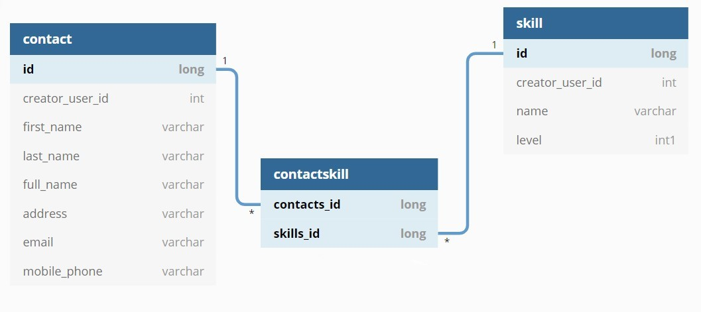

<h3 align="center">WebAPI-Contact-Challenge</h3>

<!-- TABLE OF CONTENTS -->
<details open="open">
  <summary>Table of Contents</summary>
  <ol>
    <li>
      <a href="#about-the-project">About The Project</a>
      <ul>
        <li><a href="#built-with">Built With</a></li>
      </ul>
    </li>
    <li>
      <a href="#getting-started">Getting Started</a>
      <ul>
        <li><a href="#prerequisites">Prerequisites</a></li>
        <li><a href="#installation">Installation</a></li>
      </ul>
    </li>
    <li><a href="#usage">Usage</a></li>
    <li><a href="#other-info">Other information</a></li>
    <li><a href="#contact">Contact</a></li>
  </ol>
</details>


<!-- ABOUT THE PROJECT -->
## About The Project
Basic web API with two CRUD endpoint, contactsapi/contact and contactsapi/skill

### Built With

[ASP.NET Core 5.0](https://docs.microsoft.com/fr-fr/dotnet/core/dotnet-five)


<!-- GETTING STARTED -->
## Getting Started

### Prerequisites
1. [Visual Studio 2019](https://visualstudio.microsoft.com/fr/downloads/)
2. [.NET 5](https://dotnet.microsoft.com/download/dotnet/5.0)
3. [SQL Server LocalDB](https://docs.microsoft.com/en-us/sql/database-engine/configure-windows/sql-server-express-localdb?view=sql-server-ver15)


### Installation

1. Clone the repo
   ```sh
   git clone https://github.com/viollef/WebAPI-Contact-Challenge.git
   ```

<!-- USAGE EXAMPLES -->
## Usage
1. Open WebAPI Contact Challenge/WebAPI Contact Challenge.sln</br>
2. Launch ContactsAPI project with profile : Debug / IIS Express</br>
3. For testing for testing purposes you can use [PostMan](https://www.postman.com/) or equivalent and send web requests to the CRUD EndPoints: 
*https://localhost:44386/contactsapi/contact
*https://localhost:44386/contactsapi/skill </br>

<!-- OTHER INFORMATION -->
## Other Info
1. Database: </br>
	-The database is create with EntityFramework [migrations](https://docs.microsoft.com/fr-fr/ef/core/managing-schemas/migrations/?tabs=dotnet-core-cli) by default in C:\Users\<user> </br>
	-Migration generated with Package Manager Console: "add-migration" </br>
	-Diagram: </br>
	 </br>
	
2. Object-relational mapper: </br>
	-[EF6](https://docs.microsoft.com/fr-fr/ef/ef6/) </br>
	-LazyLoading disable, mostly managed with eager loading </br>
	

<!-- CONTACT -->
## Contact

[Fabien Viollet](https://www.linkedin.com/in/fabien-viollet-297832b6/) - fabien.violletc@gmail.com

Project Link: [https://github.com/your_username/repo_name](https://github.com/viollef/WebAPI-Contact-Challenge)